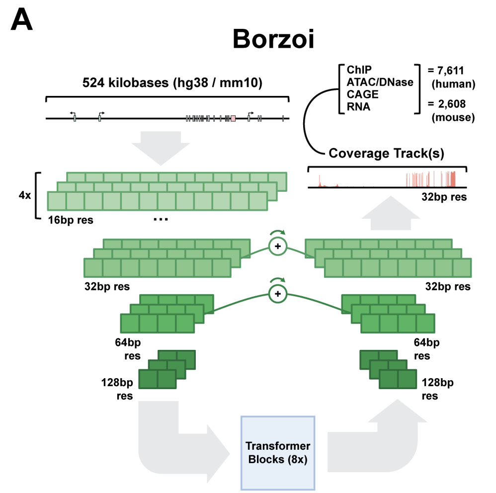
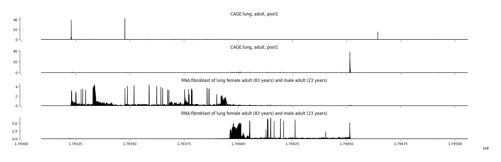
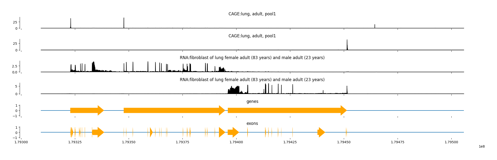
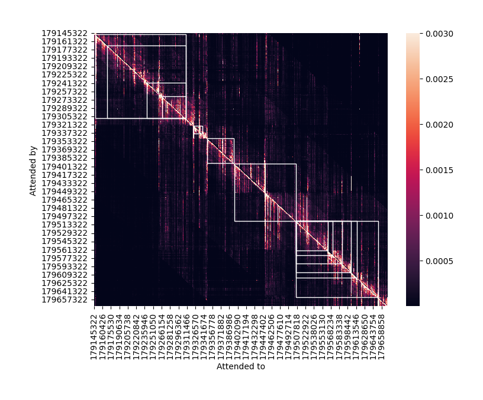
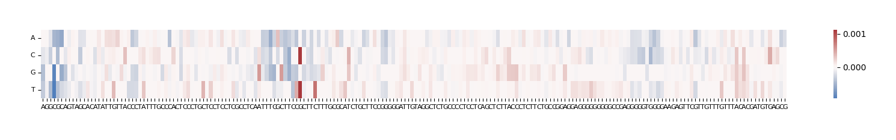
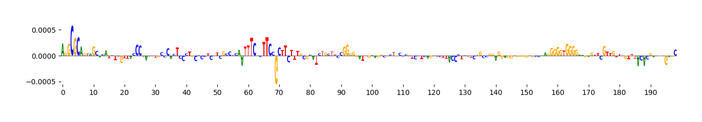

# gReLU Inference to Predict RNA-seq Coverage
This project uses the Borzoi model from gReLU to predict RNA-seq coverage tracks given a DNA genomic sequence from human genome hg38 chromosome 3. gReLU is a Python library to train, interpret, and apply deep learning models to DNA sequences. Borzoi is one of the pre-trained models from the model zoo that uses a convolutional neural network to predict RNA-seq coverage given 524kb input sequences. 

## Table of Contents
- [Background](#background)
- [Previous Work](#Previous-Work)
- [Borzoi Architecture](#Borzoi-Architecture)
- [Model Performance](#Model-Performance)
- [Interpretation](#Interpretation)
- [In-Silico Mutagenesis](#In-Silico-Mutagenesis)
   - [Heatmap](#Heatmap)
   - [Sequence Logo Map](#Sequence-Logo-Map)
- [Future Directions](#Future-Directions)
- [Citations](#Citations)

--- 

## Background

Deep learning is crucial in genomics because it enables researchers to analyze vast amounts of genomic data, identifying patterns and making predictions about gene function, disease associations, and other biological processes with significantly higher accuracy than traditional methods. 

Deep learning models are increasingly being used to perform a variety of tasks on DNA sequences, such as predicting tissue- and cell type-specific sequence activity, deriving cis-regulatory rules, predicting non-coding variant effects, and designing synthetic regulatory sequences. The Borzoi model from gReLU's model zoo was trained on RNA-seq data to predict tissue and cell specific gene expression. From a single RNA-seq experiment, Borzoi derives the primary cell type/state-specific, transciption factor motifs and a genome-wide map of nucleotide influence on gene structure and expression. 

This project aims to discover the tissue specificity and associated cis-regulatory elements of the PIK3CA gene associated with multiple types of cancer (breast, lung, ovarian, brain, liver). 

## Previous Work 

In the paper by Linder et al. (2023), they showed that Borzoi can predict exon-intron coverage patterns with striking concordance for even long genes with many exons. Borzoi's predictions match RNA-seq coverage with a mean 0.83 Pearson R across human samples and can explain a significant amount of the variation observed between tracks (such as tissue- and cell type-specific differences).

## Borzoi Architecture 

The Borzoi architecture consists of a U-net with a tower of convolution and subsampling blocks followed by a series of self-attention blocks operating at 128 bp resolution 
in the contracting path. Self-attention is a critical feature of this model as it allows every pair of position vectors to exchange information. In the expansive path the 
vectors are upsampled from the attention blocks and combined with the corresponding feature map of equal size produced by the initial convolution tower. 

 

## Model Performance 

The Borzoi model was able to predict CAGE-seq and RNA-seq coverage from chr3:179309162-179505770 in specific tissues, lung tissue shown below. 

Annotations were added to the coverage tracks using UCSC annotations tools. 

## Interpretation

An attention weight matrix of the Borzoi Transformer model visually represents how much "attention" a model is paying to each element within a sequence of data, essentially highlighting which parts are most relevant to the current prediction, with higher values indicating greater importance and focus on that specific element compared to others in the genomic sequence.

## In-Silico Mutagenesis 
In Silico Mutagenesis (ISM) was performed to identify which bases in the input sequence are contributing to the tissue-specific expression.
The `ISM_predict` function in `grelu.interpret.score` performs every possible single-base substitution on the given sequence, predicts the effect of each substitution, and optionally compares these predictions to the reference sequence to return an effect size for each substitution. Since we are interested in performing ISM on the PIK3CA gene, PIK3CA gene's first exon 100 bp upstream and downstream from the start position of the first exon were used an input sequences.

### Heatmap 

The colors represent the change in the model's prediction for RNA-seq output when a mutation is introduced. Positions with strong red/blue nucleotides are critical for models' prediction and affect the transcription of PIK3CA. 

### Sequence Logo Map 

Nucleotide letters shows the direction and magnitude of the effect a mutation has on Borzoi's predicted expression 
Tall, positive signals identify bases critical for maintaining transcriptional activity at these positions.
Negative signals suggest bases that, when mutated to certain nucleotides, disrupt transcription. 

--- 
## Future Directions 
Moving forward I would be interested to investigate the variants of unknown signficance in the intron regions spanning thousands of base pairs away from the PIK3CA gene. As of now, many pathogenic mutations in the coding
regions of the gene have already been identified, but there are still many cis-regulatory elements that are unknown. It would be interesting to perform ISM on these regions to understand how mutations in the regulatory regions of the genome impact expression of genes involved in cancer. 

Any comments, questions, or suggestions are would be greatly appreciated, thank you! 

---
## Citations 
**Paper Citation**: Linder, J., Srivastava, D., Yuan, H., Agarwal, V., & Kelley, D. R. (2023). Predicting RNA-seq coverage from DNA sequence as a unifying model of gene regulation. bioRxiv. https://doi.org/10.1101/2023.08.30.555582

**Code adopted from**: https://github.com/Genentech/gReLU/tree/main and https://github.com/calico/borzoi/tree/main 

